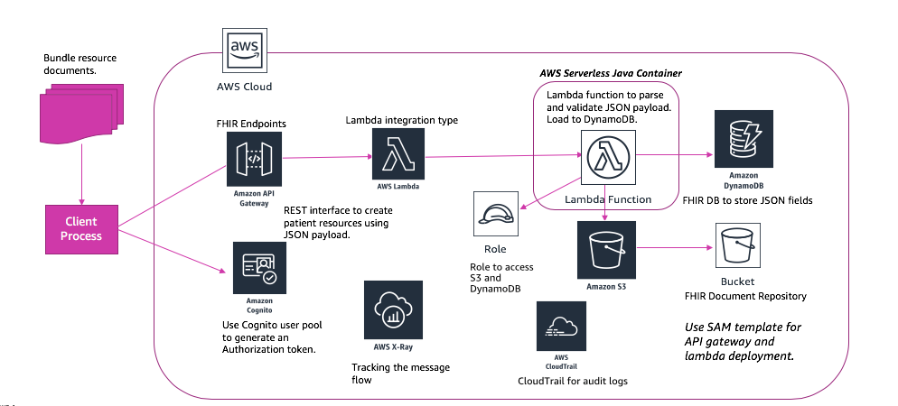

# FHIRServer
Servlerless implementation of FHIR API's using AWS services.Provides interactions on Patient, Bundle and Observation resources.We will focus on building a FHIR server which has its own FHIR data repository. It will only support JSON as the supported content type over HTTPs. Bundle,Patient and Observation are the resource types that we will support. The interactions include posting a bundle as a collection of patient and observations, search patient and observations, update patient and read patient. The system level interaction would be generating a capability statement. The architecture would be using different AWS serverless services to build the various layers of the architecture. The endpoints would be hosted on Amazon API gateway and the compute layer will use AWS Lambda. The database and storage layer would be built on Amazon DynamoDB and S3. The endpoints would be secured using Amazon Cognito. The diagram shows the architecture for the implementation of FHIR server:

